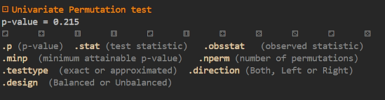

## PermutationTests.jl

|     | [](https://Marco-Congedo.github.io/PermutationTests.jl/stable) | [](https://juliamanifolds.github.io/PermutationTests.jl/latest/) |
|:---------------------------------------:|:--:|:--:|


A fast pure-[**julia**](https://julialang.org/) package for *univariate* and *multiple comparisons* statistical *hypothesis testing* based on *permutation theory*.

---
## Installation

Execute the following command in julia's REPL:

    ]add PermutationTests

---
## Available tests

All tests have a *univariate* and *multiple comparisons* version: 
- Pearson product-moment correlation
- Trend correlation (fit of any kind of regression)
- Point bi-serial correlation*
- Student's t for independent samples
- 1-way ANOVA for independent samples
- Χ² for 2xK contingency tables*
- Fisher exact test* (2x2 contingency tables)
- Student's t for repeated-measures 
- 1-way ANOVA for repeated-measures
- Cochran Q*
- McNemar*
- One-sample Student's t  
- Sign*

(* for dicothomous data) 

---
## Quick start

As an example, let's run a Pearson correlation univariate test:

```
using PermutationTests
# number of observations
N=10 
# some random Gaussian data
x, y = randn(N), randn(N) 
t = rTest(x, y)
```

The test result `t` is a structure and its fields are printed in yellow, 
looking like this:



Thus, for exmple, the p-value and the number of permutations used by the test
are retrived such as

```
t.p
t.nperm
```
---
## About the authors

[Marco Congedo](https://sites.google.com/site/marcocongedo), corresponding author and developer of the package, is a Research Director of [CNRS](http://www.cnrs.fr/en) (Centre National de la Recherche Scientifique), working at
[UGA](https://www.univ-grenoble-alpes.fr/english/) (University of Grenoble Alpes, France).
**Contact**: first name dot last name at gmail dot com

[Livio Finos](https://pnc.unipd.it/finos-livio/), is Full professor at the  [Department of Statistical Sciences](https://www.unipd.it/en/stat) of [Univerità di Padova, Italy](https://pnc.unipd.it/).
**Contact**: first name dot last name at unipd dot it

---
## Disclaimer

This version has been roughly tested.
Independent reviewers for both the code and the documentation are welcome.

---
| **Documentation**  | 
|:---------------------------------------:|
| [](https://Marco-Congedo.github.io/PermutationTests.jl/stable) |
