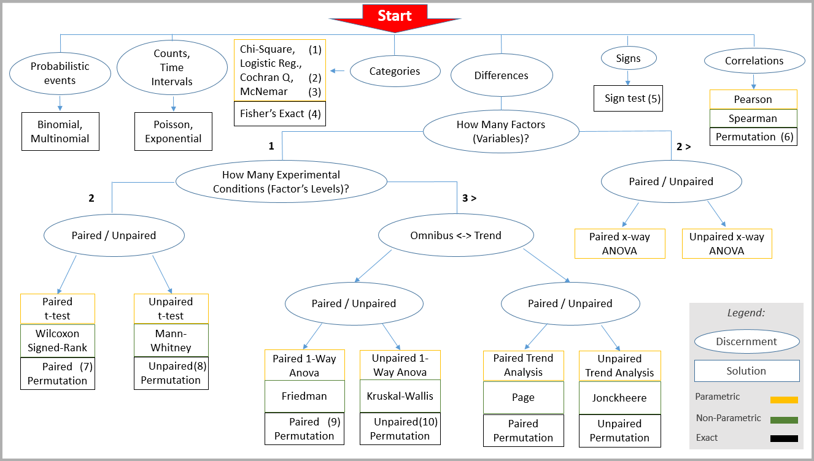

# Chose a test

The scheme below can help finding the appropriate hypothesis test giving the problem at hand.

Navigate from "**Start**" following the appropriate *ellipse* for your problem to find the solution 
in the *rectangles*. The tests that are available in this package are numbered within parentheses
and listed in the table below.

Remark that the kind of tests referred to as *independent samples* and *repeated measures* throughout this documentation are referred to in the schame as *unpaired* and *paired*, respectively. Those terms are synonimous.

|     | Univariate tests          | Multiple comparisons tests | 
|:----|:--------------------------|:---------------------------|
| (1) | [`chiSquaredTest`](@ref)  | [`chiSquaredMcTest`](@ref) |
| (2) | [`cochranqTest`](@ref)    | [`cochranqMcTest`](@ref)   |
| (3) | [`mcNemarTest`](@ref)     | [`mcNemarMcTest`](@ref)    |
| (4) | [`mcNemarTest`](@ref)     | [`mcNemarMcTest`](@ref)    |
| (5) | [`signTest`](@ref)        | [`signMcTest`](@ref)       |
| (6) | [`correlationTest`](@ref) | [`correlationMcTest`](@ref)|
| (7) | [`studentTestRM`](@ref)   | [`studentMcTestRM`](@ref)  |
| (8) | [`studentTestIS`](@ref)   | [`studentMcTestIS`](@ref)  |
| (9) | [`anovaTestRM`](@ref)     | [`anovaMcTestRM`](@ref)    |
| (10)| [`anovaTestIS`](@ref)     | [`anovaMcTestIS`](@ref)    |

---

For more available tests, see [univariate tests](@ref "Univariate tests")
and [multiple comparisons tests](@ref "Multiple comparisons tests").

