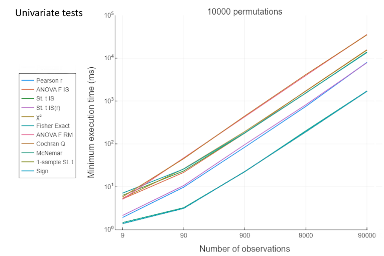
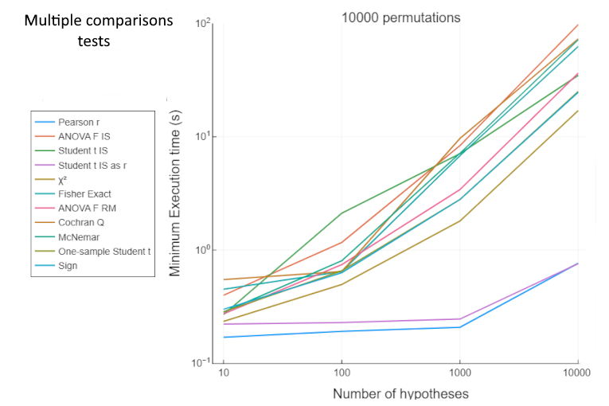
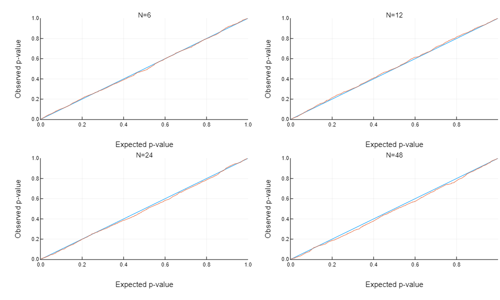

# Package tests

The code units pointed to in this page should be run within the general julia environment
once *PermutationTests.jl* has been [installed](@ref "Installation").

---

## Code tests

For testing the main functions of the package, run the `runtests.jl` unit.

---
## Benchmarks
Multiple comparison tests are multi-threaded. In general *PermutationTests.jl* is very fast; you may expect to wait less then a second to get the result of a multiple comparison correlation test involving 20000 hypotheses with samples of 20 observations each.

For running benchmarks on your computer use the `benchmarks.jl` unit located in the [src\extras\benchmarks](https://github.com/Marco-Congedo/PermutationTests.jl/tree/master/src/extras/benchmarks) folder.

In that folder you will also find a pdf showing plots and tables generated by the unit, as it is currently 
published.

---
!!! tip "Benchmarks hardware"
    Here below are the results obtained running the unit on a regular laptop running under Windows 10
    equipped with a *Intel Core i7-8650U CPU @ 1.90GHz* and *32Go of RAM*.

For **univariate tests**, the figure below reports the minimum execution time for approximate tests using 10000 random permutations for various numbers of observations (e.g., subjects):

*Legend: IS=independent samples, RM=repeated measures, 1S=one-sample, St.=Student*

We see that with 9000 observations, all tests executes within 4s, with the
correlation/trend test, all types of t-tests, the McNemar test and the sign test executing within 1s. 

---

For **multiple comparisons tests**, the figure below reports the minimum execution time for approximate tests using 10000 random permutations for 12 observations and various numbers of hypotheses:

*Legend: IS=independent samples, RM=repeated measures, 1S=one-sample, St.=Student*

We see that for sample size = 12 and 1000 hypotheses, the correlation and t-test for independent samples complete in about 200ms, while the other tests need about 2 to 8 seconds.

---
## Error Control

All univariate statistical hypothesis tests must control the 
[type I error](https://en.wikipedia.org/wiki/Type_I_and_type_II_errors) under the null hypotheses.

As explained in the [overview](@ref "Overview"), the multiple comparisons tests implemented in *PermutationTests.jl*
control the [(FWE)](https://en.wikipedia.org/wiki/Family-wise_error_rate) rate under the global null hypothesis.

The `errorControl.jl` unit located in the [src\extras\errorControl](https://github.com/Marco-Congedo/PermutationTests.jl/tree/master/src/extras/errorControl) folder runs simulations to verify these errors
for all implemented tests. 

In that folder you will also find a pdf showing the plots of the data the unit produces as it is currently 
published.

As an example, in the figure below the orange line is the p-p plot of the observed p-values versus the expected p-values under the null hypothesis. The plot has been obtained with 1000 simulations of a **univariate Pearson correlation test** by data permutation with four sample sizes (``N``). The blue line traces the expected 
p-values (control level):

---

For **multivariate permutation tests**, the figure below show the proportion of rejected hypotheses obtained 
across 100 simulations for several tests and 2, 5, 10 or 100 hypotheses tested simultaneously. 
The FWE is controlled if the proportion is inferior to the nominal FWE level of the test, 0.05 for this simulation.

---
## Power

The power of a statstical hypothesis test is the probability that the test correctly rejects the null 
hypothesis when it is false. It depends on many factors, including the sample size, the effect size,
the characteristics of the test and more.

The `power.jl` unit located in the [src\extras\power](https://github.com/Marco-Congedo/PermutationTests.jl/tree/master/src/extras/power) folder contains example code to estimate the power of two univariate and multiple comparisons tests implemented in *PermutationTests.jl*. The code can be expanded for the other implemented tests as well as for running the power analysis with different parameters.

In that folder you will also find a pdf showing the plots of the data the unit, as it is currently 
published, produces.

As an example, the figure below compares the power of the **univariate Pearson correlation test** to its parametric counterpart, which is the usual test for correlation or of the slope of a regression line 
(see section "Slope of a regression line" [here](https://en.wikipedia.org/wiki/Student's_t-test)).
The power is estimated for four sample size values (``N``) using random Gaussian data and 1000 simulations.

We see that the power of the permutation and parametric test is very close for all sample size values.

---

For **multivariate permutation tests**, the figure below show the proportion of truly rejected hypotheses 
(number of rejected hypotheses divided by the number of false hypotheses) of the t-test for 
indipendent samples ( 8 subjects per group) obtained with 100 simulations when testing 5, 20 and 100 hypotheses simultaneously (``M``). 
In these simulations, multivariate Gaussian data is
generated under ``H_0`` for half of the hypotheses and for the remaining half with an effect size allowing
an expected p-value equal to 0.01 for each hypothesis tested separatedly with the parametric test.
The hypotheses have geen generated uncorrelated and with two different degrees of uniform correlation such that the expected p-value of the correlation ``𝔼p(ρ)`` is equal to either 0.1 or 0.01. See the [preamble](@ref "Preamble")
for a discussion on correlation among hypotheses. 

We see that, on the average of all simulations, the multiple comparisons permutation max-t test 
implemented in this package is always more powerful than the Bonferroni correction procedure,
it does not matter the number of hypotheses and whether the hypotheses are correlated or not. 
The advantage of the permutation approach increases as the correlation among variables (ρ) increases (hence its expected p-value decreases).

